# Implementation Technology Architecture
*Arsitektur teknologi KongsiLogi & Freshness AI yang efisien, responsif, dan didukung kecerdasan buatan.*

---

## 1. Architecture Diagram

Berikut adalah alur data mulai dari perangkat keras/pengguna hingga ke pemrosesan AI dan Database.

```mermaid
graph TD
    %% Styling
    classDef hardware fill:#e2f0cb,stroke:#82b366,stroke-width:2px;
    classDef frontend fill:#dae8fc,stroke:#6c8ebf,stroke-width:2px;
    classDef backend fill:#ffe6cc,stroke:#d79b00,stroke-width:2px;
    classDef db fill:#f8cecc,stroke:#b85450,stroke-width:2px;
    classDef ai fill:#e1d5e7,stroke:#9673a6,stroke-width:2px;

    subgraph Inputs ["Data Sources & Hardware"]
        RFID["RFID Scanner\n(Smart Receiving)"]:::hardware
        WebUser["Web User\n(Admin/Kasir)"]:::hardware
        MobileCam["Mobile Camera\n(Freshness AI)"]:::hardware
    end

    subgraph FrontendLayer ["Frontend & Mobile Layer"]
        NextFront["KongsiLogi Web\n(Next.js + Tailwind)"]:::frontend
        Expo["Freshness AI Mobile\n(Expo / React Native)"]:::frontend
    end

    subgraph BackendLayer ["Backend Services"]
        NextAPI["Serverless API\n(Node.js + Prisma)"]:::backend
    end

    subgraph DatabaseLayer ["Database Layer"]
        Supabase[("Supabase\n(PostgreSQL)")]:::db
    end

    subgraph AILayer ["AI & ML Engine"]
        Gemini["Google Gemini 1.5\n(Generative AI)"]:::ai
        Stats["Exponential Smoothing\n(Forecasting Algorithm)"]:::ai
        Vision["Computer Vision Model\n(Freshness Detection)"]:::ai
    end

    %% Flow
    RFID -->|Keyboard Emulation| NextFront
    WebUser --> NextFront
    MobileCam -->|Image Data| Expo
    
    Expo -.->|Local Processing| Vision
    Vision -.->|Freshness Score| Expo
    Expo -->|API Sync| NextAPI

    NextFront -->|API Requests| NextAPI
    
    NextAPI -->|Read/Write| Supabase
    NextAPI -->|Calculate Trend| Stats
    NextAPI -->|Prompt & Data| Gemini
```

---

## 2. Technology Breakdown

| Kategori | Teknologi Utama | Deskripsi Peran dalam Sistem |
| :--- | :--- | :--- |
| **Frontend & Mobile** | **Next.js, Expo (React Native), Tailwind CSS** | Menyediakan UI web yang interaktif untuk manajemen koperasi (KongsiLogi) dan aplikasi mobile lintas platform (Freshness AI) agar pengguna nyaman saat operasional di lapangan. |
| **Backend & ORM** | **Next.js API Routes, Node.js, Prisma** | Berfungsi sebagai penghubung logika bisnis utama, memproses transaksi kasir, dan mengelola keamanan data antara frontend dan database. |
| **Database** | **Supabase (PostgreSQL)** | Penyimpanan data relasional terpusat yang tangguh, mengelola ribuan data riwayat penjualan, inventaris, dan sesi *quality control* secara *real-time*. |
| **Generative AI & Forecasting** | **Gemini 1.5 Flash API, Exponential Smoothing** | Mesin rekomendasi produk; mengonversi data statistik peramalan penjualan menjadi bahasa natural Indonesia untuk panduan restock/pengadaan. |
| **Mobile AI (Freshness)** | **TensorFlow Lite / Computer Vision** | Berjalan di dalam platform mobile *Freshness AI* untuk menganalisis gambar sayur/buah dari kamera, mengukur tingkat kesegaran, dan memberikan *scoring* otomatis. |
| **Hardware Integration** | **RFID Scanner (Keyboard Emulation)** | Mendukung fitur *Smart Receiving*, membaca tag masuk barang secara instan tanpa perlu integrasi driver yang rumit. |
| **Deployment** | **Vercel & Supabase Cloud** | Menyediakan layanan cloud otomatis (CI/CD) selama tahap pengembangan untuk memastikan aplikasi web dan backend berjalan stabil dan *scalable*. |

---

## 3. Technology Advantage

> [!TIP]
> **AI/ML & Hardware Integration**
> Mengintegrasikan pendekatan berlapis: Model **Computer Vision** di mobile (Freshness AI) untuk memvalidasi kualitas fisik barang masuk, **RFID** untuk pencatatan otomatis, dan algoritma matematis + **LLM (Gemini)** di web (KongsiLogi) untuk memprediksi kapan barang harus dibeli lagi.

> [!TIP]
> **Fullstack & Real-time Ecosystem**
> Dengan arsitektur **Next.js** dan **Supabase** sebagai fondasi utama, sistem memastikan bahwa saat staf lapangan men-scan kesegaran sayur lewat *Freshness AI*, datanya langsung tersinkronisasi *real-time* ke sistem web pusat yang dipantau oleh Admin Koperasi.
